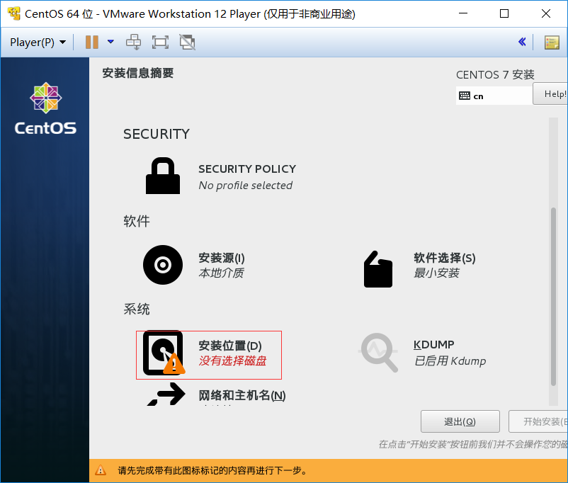

# window下使用vmplayer搭建虚拟机环境centos

- vmplayer是vmware提供的免费虚拟机软件
- centos是开源免费的linux发行版本

## 安装vmplayer

### 1. 打开vmware官网
[http://www.vmware.com/cn.html](http://www.vmware.com/cn.html)

### 2. 下载软件

### 3. 安装软件

安装完成后首次启动需要填入一个邮箱地址,用于接受相关的促销邮件，然后进入主界面，安装完成。

## vmplayer安装centos

### 1. 打开centos官网
[https://www.centos.org/](https://www.centos.org/)

### 2. 下载contos7 minimal版本，注意选择64位或32位
163镜像下载地址:
[http://mirrors.163.com/centos/7/isos/x86_64/CentOS-7-x86_64-Minimal-1511.iso](http://mirrors.163.com/centos/7/isos/x86_64/CentOS-7-x86_64-Minimal-1511.iso )

### 3. 创建虚拟机
菜单-Player-文件-新建虚拟机

选择之前下载的ios文件

一路下一步，最后自定义硬件将网络适配器选择桥接模式。

点击完成，自动启动虚拟机，选择Install CentOS 7

等待一会，进入选择语言

设置硬盘

设置root密码

等待安装成功后点击重启

然后输入用户名root和密码，进入系统

本地虚拟机centos搭建完成

*网络适配器模式说明*
- 桥接模式：类似局域网中的独立主机，可访问公网，可互相访问局域网内主机
- NAT模式：可通过主机访问公网，局域网内主机不能访问虚拟机
- 主机模式：不能访问公网，类似虚拟机与真实网络隔离

## 虚拟机连接公网
由于选择的是桥接模式，需要配置虚拟机的网络才能连接公网，使用命令

    ip addr

查看虚拟机当前网络

### 修改配置文件

    vi /etc/sysconfig/network-scripts/ifcfg-eno16777736 #上述命令查找到的网卡配置文件

1. 将 ONBOOT=no 改为 ONBOOT=yes (此时重启将由路由器DHCP自动分配IP，为了固定IP继续设置)
2. 将 BOOTPROTO=dhcp 删除
3. 补上配置：

    IPADDR0=192.168.0.120   #IP设置
    GATEWAY0=192.168.0.1    #网关设置
    PREFIX=24               #子网掩码
    DNS1=192.168.0.1        #DNS设置

*网关和DNS设置为当前主机的路由器IP*
### 重启生效

## centos配置yum源
官网下载的centos系统配置的yum源为国外的地址，访问缓慢。需要配置为国内的yum源

    cd /etc/yum.repos.d  #进入yum源配置目录
    mv CentOS-Base.repo CentOS-Base.repo.bk #备份系统自带的yum源配置文件
    curl -o CentOS-Base.repo http://mirrors.aliyun.com/repo/Centos-7.repo  #下载阿里云yum源
